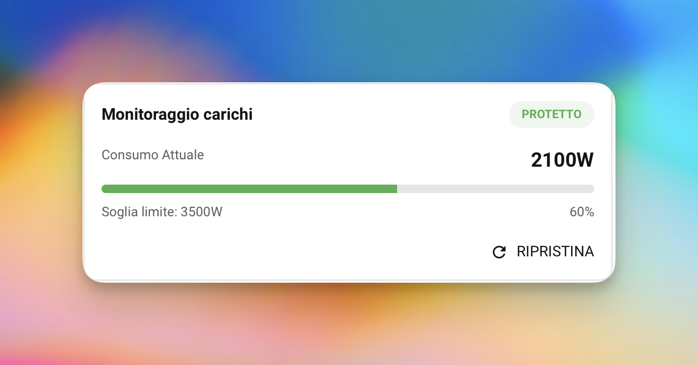
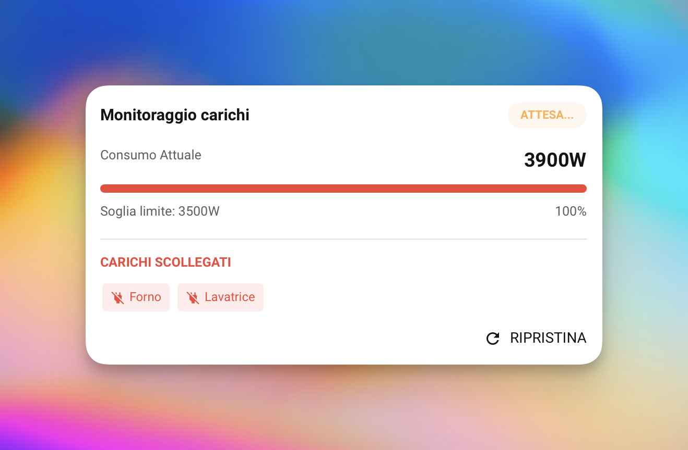
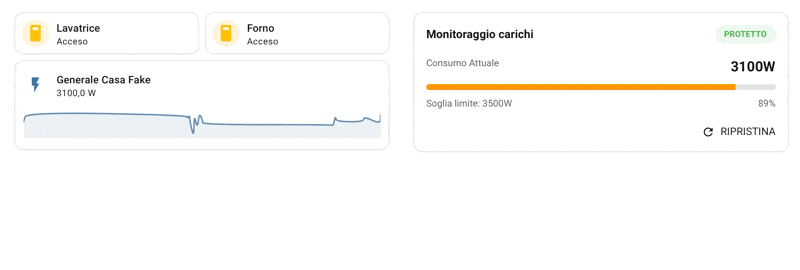

<div align="center">


# AvoidBlackout ⚡

**Smart Power Manager for Home Assistant**

Protect your home from circuit breaker trips — automatically.

[](https://github.com/hacs/integration)


</div>

---

**AvoidBlackout** is a smart Home Assistant integration that monitors your home's real-time power consumption and automatically sheds non-essential loads before your circuit breaker trips. Set your power threshold, define which devices to turn off first, and let the integration handle the rest.

<div align="center">

| Normal State | Shedding Active |
|:---:|:---:|
|  |  |

</div>

---

## ✨ Features

- **Active Protection** — Monitors power sensors and steps in before the breaker trips.
- **Priority Management** — You decide the order in which devices are turned off.
- **Smart Debounce** — Prevents false shutdowns caused by momentary power spikes.
- **Live Configuration** — Change threshold and debounce directly from your dashboard. Changes apply instantly, no restart needed.
- **Premium Card** — A beautiful Lovelace card to monitor status and restore loads with one tap.
- **Smart Notifications** — Included Blueprint for instant alerts on your phone or smart speaker.
- **Test Mode** — Simulate shedding logic without actually turning anything off.
- **Multilingual** — Full Italian 🇮🇹 and English 🇬🇧 support.

---

## 📦 Installation via HACS

1. Open **HACS** in Home Assistant.
2. Go to **Integrations** → click the three-dot menu (top right).
3. Select **Custom Repositories**.
4. Paste this repository URL and select category `Integration`.
5. Click **Download** and restart Home Assistant.

---

## ⚙️ Configuration

After installation, add the integration from **Settings → Devices & Services**:

1. Search for **AvoidBlackout**.
2. **Power Sensors** — Select one or more power sensors (W). If you select multiple, their values are summed (useful for multiple clamp meters).
3. **Threshold** — Set your contracted power limit (e.g. `3300` for a 3 kW contract).
4. **Debounce** — Seconds to wait before acting after the threshold is exceeded.
5. **Priority Order** — Select which devices to manage and in what order they will be turned off.

> 💡 **Threshold and Debounce can be changed at any time** — either from the integration settings or directly via the dedicated dashboard entities (see [Exposed Entities](#-exposed-entities)). Changes are applied in real time without restarting the integration.

---

## 🔌 Exposed Entities

The integration automatically creates the following entities under the **AvoidBlackout PowerManager** device.

### 🔢 Number Entities (configurable from the dashboard)

| Entity | Description | Unit | Range |
|--------|-------------|------|-------|
| `number.avoidblackout_max_threshold` | Maximum power threshold. Change it to update the limit in real time. | W | 100 – 10,000 |
| `number.avoidblackout_debounce_time` | Wait time before the integration acts. Change it to update the delay in real time. | s | 5 – 300 |

The `number` entities are **bidirectionally synced** with the integration settings: changing the value from either side updates the other automatically.

You can add them to your dashboard as standard cards, or use them in automations to dynamically adjust the threshold and debounce (e.g. based on time of day).

**Example YAML card:**

```yaml
type: entities
title: AvoidBlackout — Configuration
entities:
  - entity: number.avoidblackout_max_threshold
  - entity: number.avoidblackout_debounce_time
```

### 📊 Sensor Entities (read-only)

| Entity | Description |
|--------|-------------|
| `sensor.avoidblackout_status` | System state (`monitoring`, `waiting`, `shedding`) with detailed attributes |

**Status sensor attributes:**

| Attribute | Description |
|-----------|-------------|
| `total_power` | Current total power draw (W) |
| `threshold` | Active power threshold (W) |
| `is_over_threshold` | `true` if power exceeds the threshold |
| `shutdown_entities` | List of devices currently turned off by the integration |
| `managed_entities_count` | Number of managed devices |
| `test_mode` | `true` if test mode is active |

---

## 🃏 Lovelace Card

The card is registered automatically. To add it to your dashboard, pick it from the card picker or paste this YAML:

```yaml
type: custom:avoidblackout-card
entity: sensor.avoidblackout_status
name: "Energy Monitor"  # Optional
```

<div align="center">

</div>

---

## 🔔 Notifications & Blueprint

A Blueprint is included to simplify creating automations that alert you when a load-shedding event begins:

1. Go to **Settings → Automations & Scenes → Blueprints**.
2. Find **Load Shedding Notification (AvoidBlackout)**.
3. Click **Create Automation**.
4. Select the status sensor and your notification service (e.g. `notify.mobile_app_your_phone`).

For more advanced automations, use the `is_over_threshold` attribute as a template trigger:

```yaml
triggers:
  - trigger: template
    value_template: "{{ state_attr('sensor.avoidblackout_status', 'is_over_threshold') }}"
```

---

## 🛠️ Services

| Service | Description |
|---------|-------------|
| `avoidblackout.reset_history` | Restores all shed devices and returns the system to monitoring mode. |
| `avoidblackout.simulate_overload` | Forces a shedding cycle — useful for testing automations. Requires **Test Mode** to be active. |

---

## 🌍 Languages

| Language | Status |
|----------|--------|
| 🇮🇹 Italiano | ✅ Supported |
| 🇬🇧 English | ✅ Supported |

---

## 📄 Changelog

See [CHANGELOG.md](CHANGELOG.md) for the full version history.

---

<div align="center">

Made with ❤️ for the Home Assistant community.

*If you find this project useful, please leave a ⭐ on GitHub or [buy me a coffee](https://www.buymeacoffee.com) ☕*

</div>
